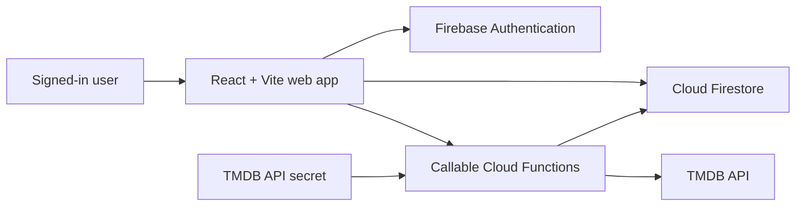

# Night Watcher

Night Watcher is a real-time collaborative movie-night decision app. Friends create a private room, join with a short code, define the mood for the evening, and vote through a shared TMDB-powered movie queue. When every active participant likes the same movie, the app records a match and shows its trailer and streaming availability for the room's country.

**Live demo:** https://night-watcher-29a02.web.app

## Highlights

- Sign in with Google or email/password using Firebase Authentication.
- Create private rooms with cryptographically random, collision-safe six-character codes.
- Join an existing room by code and see participants update in real time.
- Select a streaming country, genres, maximum runtime, starting year, and adult-content preference before starting a room.
- Generate a server-side, deterministic TMDB queue shared by every room member.
- Vote like/pass with buttons or keyboard shortcuts: `Right Arrow` likes and `Left Arrow` passes.
- Detect a match transactionally when every room member likes the same movie.
- Display trailer links and country-specific streaming-provider information.
- Persist room matches and view them through Match History.
- Begin a new matching round while preserving the room's prior matches.
- Send secure presence heartbeats while a room is open.

## Technology Stack

| Area | Technologies |
| --- | --- |
| Frontend | React 19, TypeScript, Vite |
| UI | CSS, Lucide React icons, responsive layout |
| Authentication | Firebase Authentication: Google redirect flow and email/password |
| Database | Cloud Firestore Native, named database `night-watcher` in `asia-south1` |
| Serverless backend | Firebase Cloud Functions Gen 2, Node.js 24, TypeScript, Firebase Admin SDK |
| Movie data | TMDB Discover, Movie Details, Videos, and Watch Providers APIs |
| State and real-time sync | React hooks plus Firestore `onSnapshot` listeners |
| Security | Firebase Authentication, Firestore security rules, Firebase Secret Manager |
| Hosting and deployment | Firebase Hosting, Firebase CLI, Artifact Registry cleanup policy |
| Quality checks | TypeScript, ESLint for Functions, Oxlint, Vite production builds |

## Architecture



The web app reads only the Firestore documents that authenticated room members are permitted to see. Cloud Functions own room creation, joining, queue generation, voting, matching, lifecycle actions, and presence updates. This avoids exposing the TMDB credential or allowing browser clients to write sensitive room state directly.

## User Flow

1. A user signs in with Google or an email/password account.
2. The user creates a room or joins one with a six-character invite code.
3. The host selects movie preferences and starts matching.
4. A callable Function fetches a TMDB queue and writes the shared queue to Firestore.
5. Every participant views the same ordered queue and records likes or passes.
6. When all active members like one movie, a transaction creates one match record and updates the room status.
7. Participants can see the trailer, streaming providers, and saved Match History.
8. The host can launch another round or end the room.

## Firestore Data Model

```text
users/{uid}
  name, email, photoURL, joinedAt, lastSeenAt

roomCodes/{code}
  roomId, createdAt

rooms/{roomId}
  code, hostId, status, country, preferences, queueSize, round,
  matchedMovieId, createdAt, updatedAt, endedAt

rooms/{roomId}/members/{uid}
  name, email, photoURL, role, isOnline, joinedAt, lastSeenAt

rooms/{roomId}/queue/{tmdbMovieId}
  tmdbId, title, overview, posterPath, releaseYear, rating, runtime,
  genres, trailerKey, providerNames, order, createdAt

rooms/{roomId}/votes/{tmdbMovieId}_{uid}
  movieId, userId, liked, votedAt

rooms/{roomId}/matches/{tmdbMovieId}
  movieId, movie, members, matchedAt
```

## Cloud Functions

| Function | Purpose |
| --- | --- |
| `createRoom` | Creates a room, atomically reserves its code, and adds the host as the first member. |
| `joinRoom` | Validates an invite code and joins the authenticated user to the room. |
| `leaveRoom` | Removes a non-host member from a room. |
| `endRoom` | Lets only the host end the room while retaining its history. |
| `startMatching` | Lets the host fetch and persist the first TMDB room queue. |
| `castVote` | Saves a vote and transactionally creates a match when all members like a movie. |
| `continueMatching` | Clears the active queue/votes and creates a new round after a match. |
| `heartbeatRoom` | Refreshes a member's active presence timestamp. |

## Local Setup

### Prerequisites

- Node.js 24 or newer
- npm
- Firebase CLI
- A Firebase project with Authentication, Firestore, Functions, and Hosting enabled
- A TMDB API v3 key or v4 API Read Access Token

### Install dependencies

```powershell
npm install
Push-Location functions
npm install
Pop-Location
```

### Configure Firebase web credentials

1. Copy `.env.example` to `.env.local`.
2. In Firebase Console, open **Project settings** -> **Your apps** -> Web app.
3. Copy the Firebase web configuration values into `.env.local`.

```env
VITE_FIREBASE_API_KEY=
VITE_FIREBASE_AUTH_DOMAIN=night-watcher-29a02.firebaseapp.com
VITE_FIREBASE_PROJECT_ID=night-watcher-29a02
VITE_FIREBASE_STORAGE_BUCKET=night-watcher-29a02.appspot.com
VITE_FIREBASE_MESSAGING_SENDER_ID=
VITE_FIREBASE_APP_ID=
```

Do not commit `.env.local`.

### Configure Firebase Authentication

In Firebase Console:

1. Open **Build** -> **Authentication** -> **Sign-in method**.
2. Enable **Google**.
3. Enable **Email/Password** if you want to use the email form.
4. In **Settings** -> **Authorized domains**, add:

```text
localhost
127.0.0.1
night-watcher-29a02.web.app
night-watcher-29a02.firebaseapp.com
```

### Configure the TMDB secret

TMDB is called only by Cloud Functions. Store the key in Firebase Secret Manager, not in `.env.local`.

```powershell
firebase functions:secrets:set TMDB_API_KEY
```

Enter either:

- TMDB **API Key (v3 auth)**, or
- TMDB **API Read Access Token (v4 auth)**.

The backend supports both credential formats automatically.

### Run locally

```powershell
npm.cmd run dev
```

Open http://127.0.0.1:5173.

## Validation Commands

```powershell
# Frontend type check and production bundle
npm.cmd run build

# Frontend lint
npm.cmd run lint

# Functions lint and type check
Push-Location functions
npm.cmd run lint
npm.cmd run build
Pop-Location
```

## Deploy

Build and deploy everything:

```powershell
npm.cmd run build
firebase deploy
```

Deploy only the web app:

```powershell
firebase deploy --only hosting
```

Deploy only a Function after a backend change:

```powershell
firebase deploy --only functions:castVote
```

## Security Design

- All room lifecycle operations are callable Functions that require a Firebase-authenticated user.
- Room codes are created using cryptographic randomness and reserved in Firestore transactions to prevent collisions.
- TMDB credentials are held in Firebase Secret Manager and are never shipped to the browser.
- Firestore rules prevent direct client writes to rooms, members, queues, votes, and matches.
- The voting transaction reads all necessary documents before writing a vote or match, ensuring Firestore transaction consistency.
- Users can only read rooms in which they are members.

## Testing the Collaborative Flow

1. Open the live app in a normal browser window and sign in as User A.
2. Create a room, select preferences, and copy its room code.
3. Open an Incognito/InPrivate window and sign in as User B.
4. Join the room using the code.
5. As the host, select **Start matching**.
6. Confirm both users see the same TMDB movie queue.
7. Have both users like the same movie.
8. Confirm the match modal appears and the movie is added to **History**.
9. As the host, select **Start another round** to generate a fresh queue.

## CV / Resume Entry

### One-line resume description

**Night Watcher** | Real-time collaborative movie matching web application built with React, TypeScript, Firebase, Cloud Functions, Firestore, and TMDB.

### Resume bullet points

- Built and deployed **Night Watcher**, a real-time collaborative movie decision platform where users create private rooms, join through collision-safe invite codes, and vote on a shared movie queue.
- Designed a secure Firebase backend using **Cloud Functions Gen 2**, **Firestore transactions**, and **Firebase Authentication** to manage room creation, membership, voting, consensus-based matching, match history, and presence heartbeats.
- Integrated **TMDB APIs** server-side through **Firebase Secret Manager** to generate preference-aware movie queues with genres, runtimes, trailers, and country-specific streaming-provider data.
- Developed a responsive **React 19 + TypeScript + Vite** interface with Google redirect authentication, email/password login, real-time Firestore listeners, keyboard voting, match history, and multi-round movie sessions.
- Deployed the application with **Firebase Hosting**, configured Firestore security rules, and used TypeScript/ESLint/Vite build checks to validate frontend and serverless code.

### Technologies for a resume skills section

`React`, `TypeScript`, `Vite`, `Firebase Authentication`, `Cloud Firestore`, `Firebase Cloud Functions`, `Firebase Hosting`, `Firebase Secret Manager`, `Node.js`, `TMDB API`, `REST APIs`, `Firestore Transactions`, `Real-time Systems`, `Google OAuth`, `HTML`, `CSS`, `Lucide React`, `Git`
